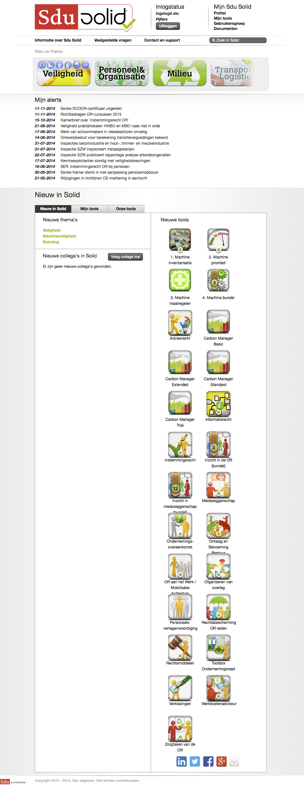
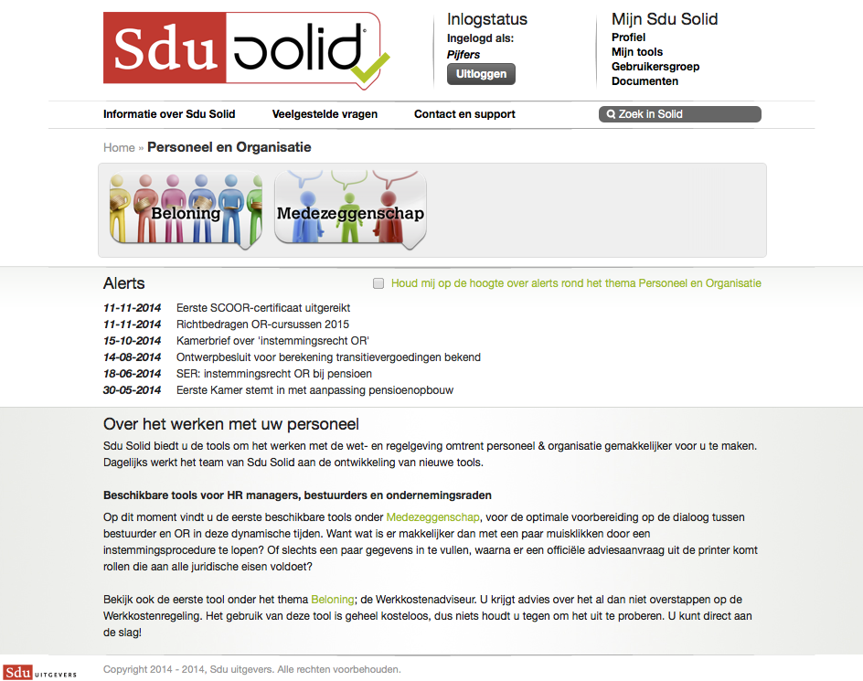
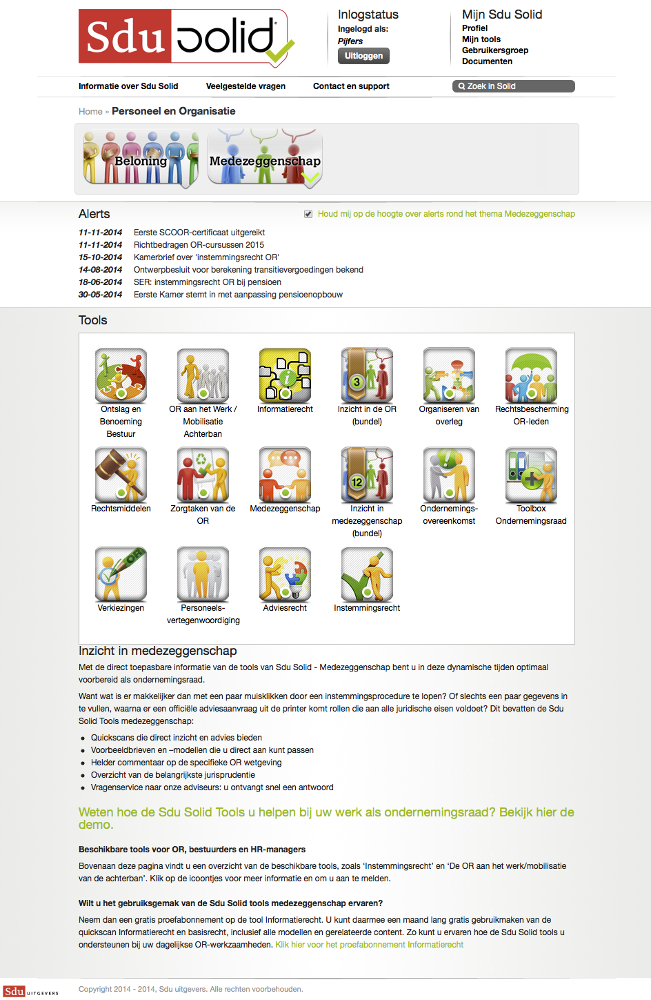
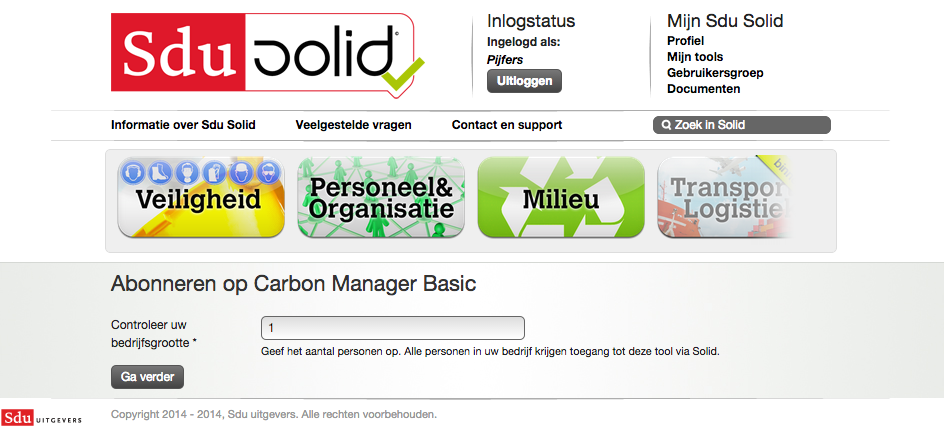
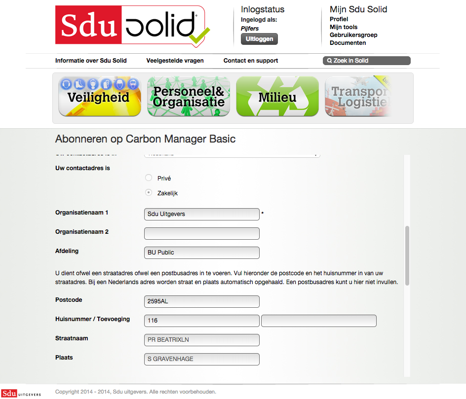
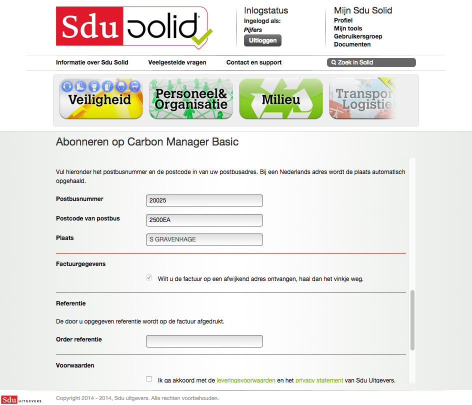
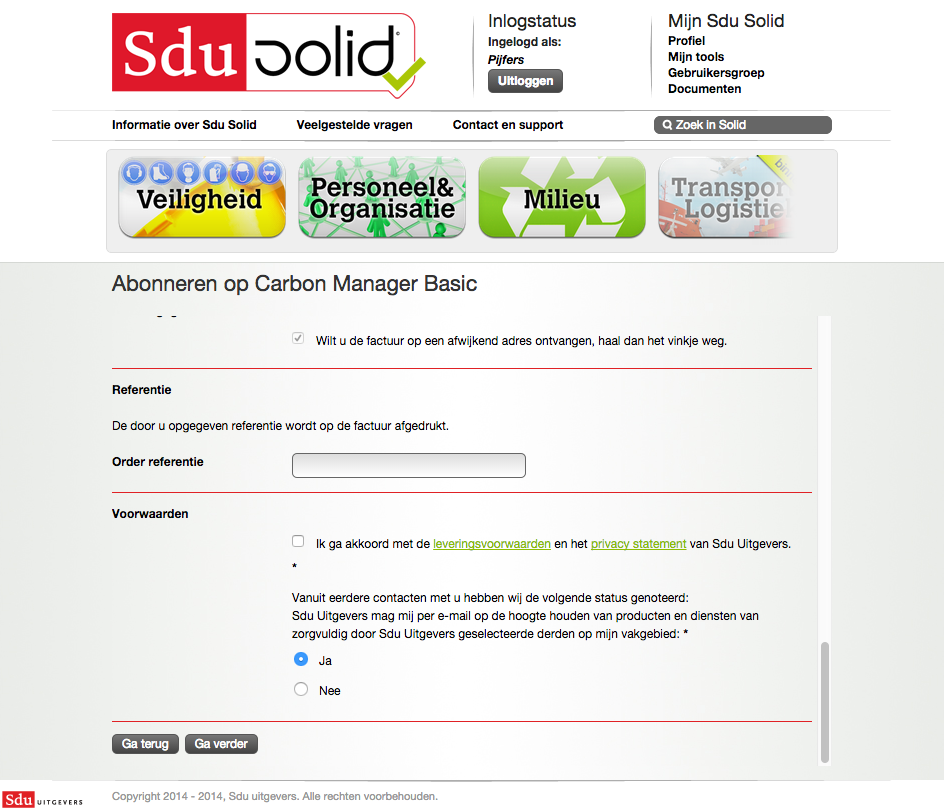

## Home (ingelogd)

Op deze pagina ziet de gebruiker de ingelogde variant van de home. Hier worden geabonneerde alerts weergegeven en kan er genavigeerd worden naar nieuwe tools, tools van de gebruikers en tools van de gebruikersgroep waarin de gebruiker zich bevind. De gebruiker klikt vervolgens door op een thema. 

## Thema

Op deze pagina ziet de gebruiker de subthema&rsquo;s die onder het betreffende thema vallen. 

## Subthema

Op deze pagina ziet de gebruiker de tools die bij het subthema horen. 

## Tool kiezen

De gebruiker ziet een specifieke pagina van een tool en kan zich hier op de tool abonneren/de tool aanschaffen. 

## Abonneren op tool

De gebruiker vult het aantal personen in de organisatie in. 

## Bevestigen juiste gebruikersaccount

De gebruiker bevestigd dat het huidige ingelogde account de juiste is. 

## Formulier: Controleren gegevens 1

## Formulier Controleren gegevens 2

## Formulier: Referentie invullen

## Formulier: Voorwaarden accepteren

## Bevestiging 

De gebruiker ontvangt een e-mailbevestiging dat hij zich heeft geabonneerd op een tool. 

